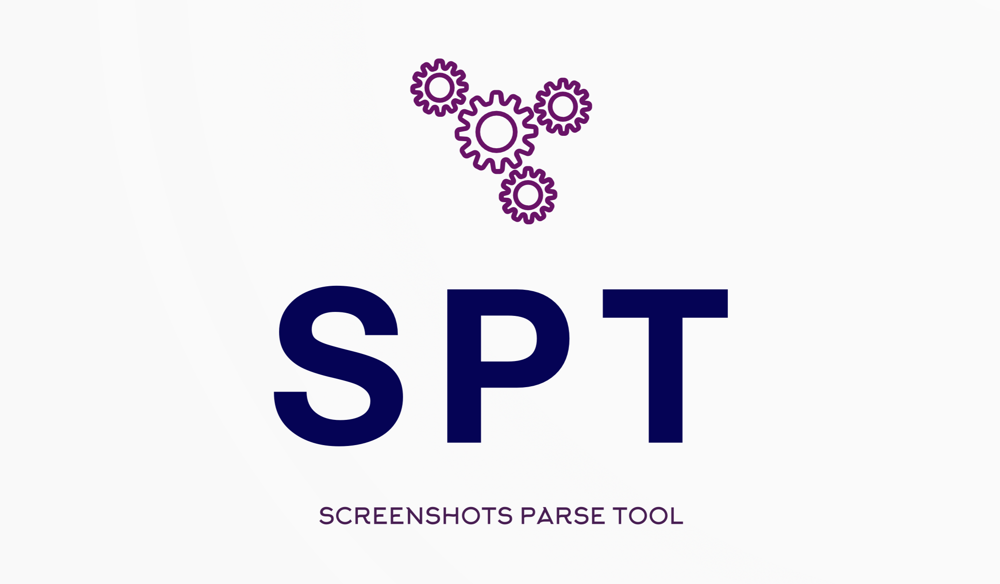
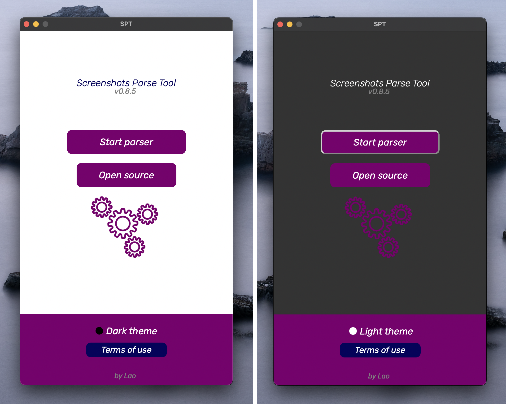
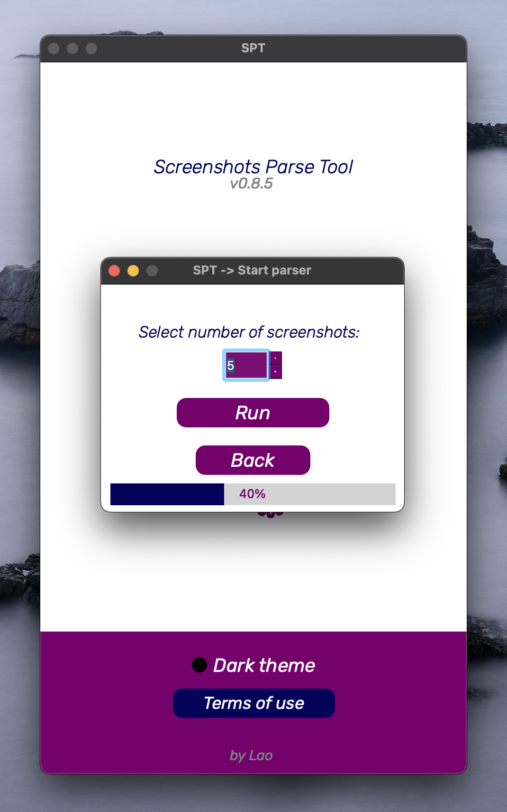
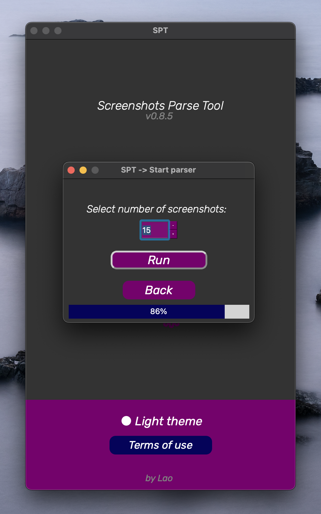
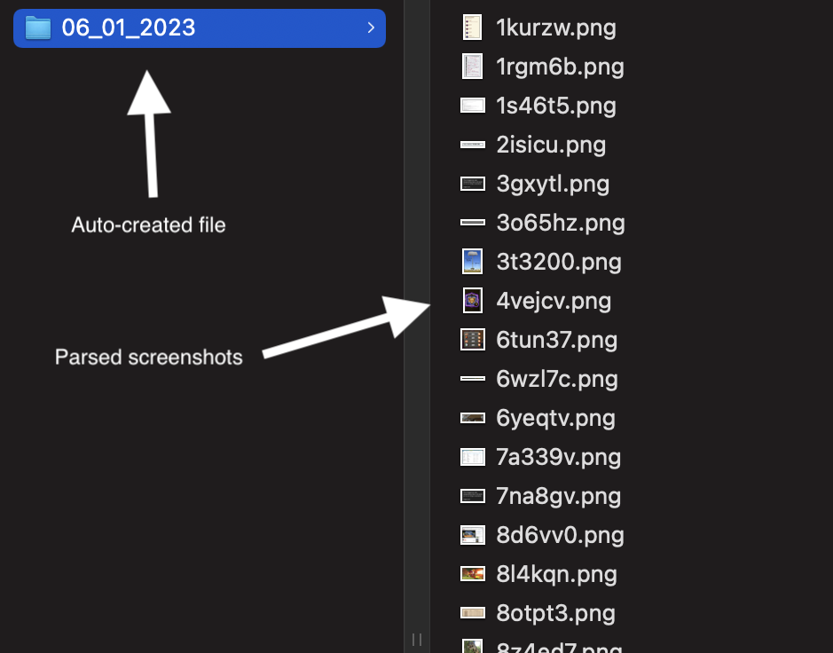

<p align="center">
  
</p>

<h1 align="center">
  SPT
</h1>

* [More info](#more-info)
* [Installation](#installation)
* [Usage](#usage)


## Screenshots
<p>
  
  
  
  
</p>


## More info
SPT (Screenshots Parse Tool) exploits the "vulnerability" in the app for making screenshots, called "Lightshot"
This "vulnerability" can show other people's screenshots, so SPT generates unique links to them and then downloades them into the auto-created folder on your PC.


## Installation
```
$ git clone https://github.com/codelao/Screenshots-Parse-Tool.git
$ cd Screenshots-Parse-Tool
$ pip3 install -r requirements.txt
$ cd app
$ python3 spt.py
```


## Usage
After running SPT you will need to agree with the terms of use before starting. You can choose the number of screenshots you want to be parsed (1-100). When the app finished parsing you will find parsed screenshots in the auto-created folder with the date in the title, for example: "Screenshots-Parse-Tool/Screenshots/06_01_2023".