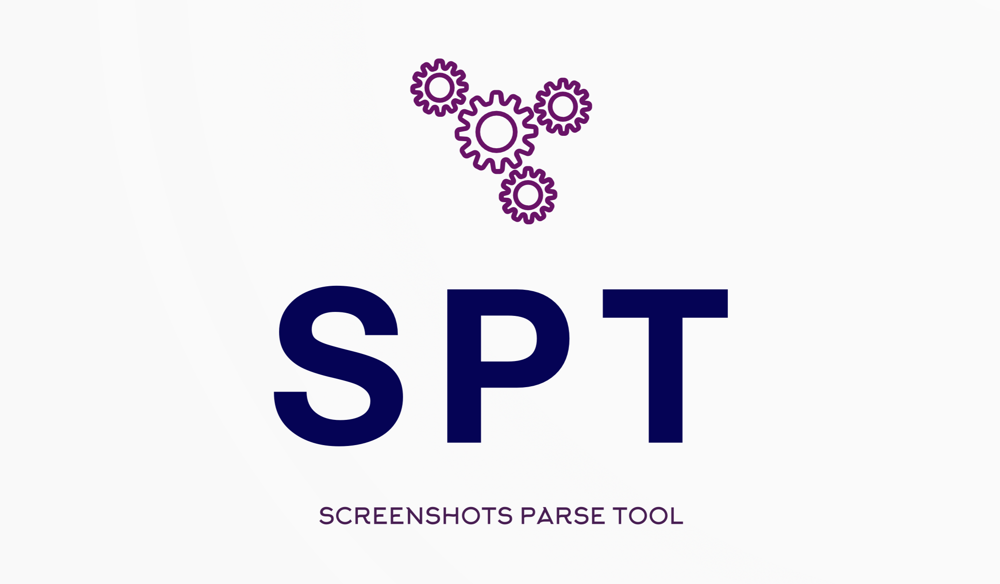
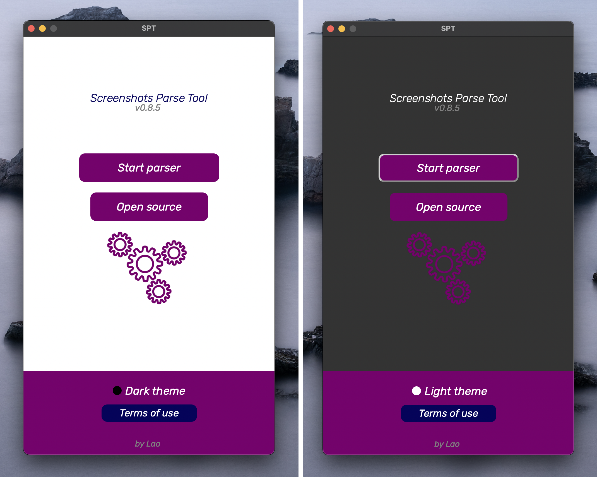
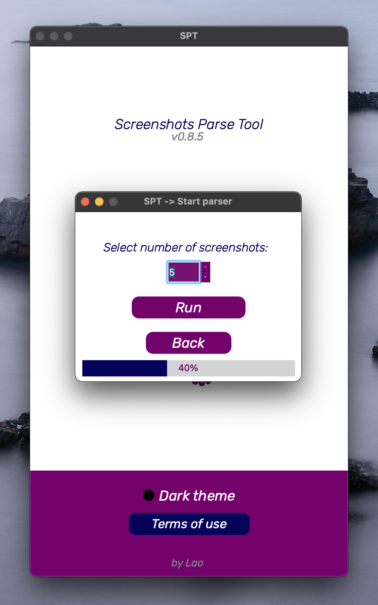
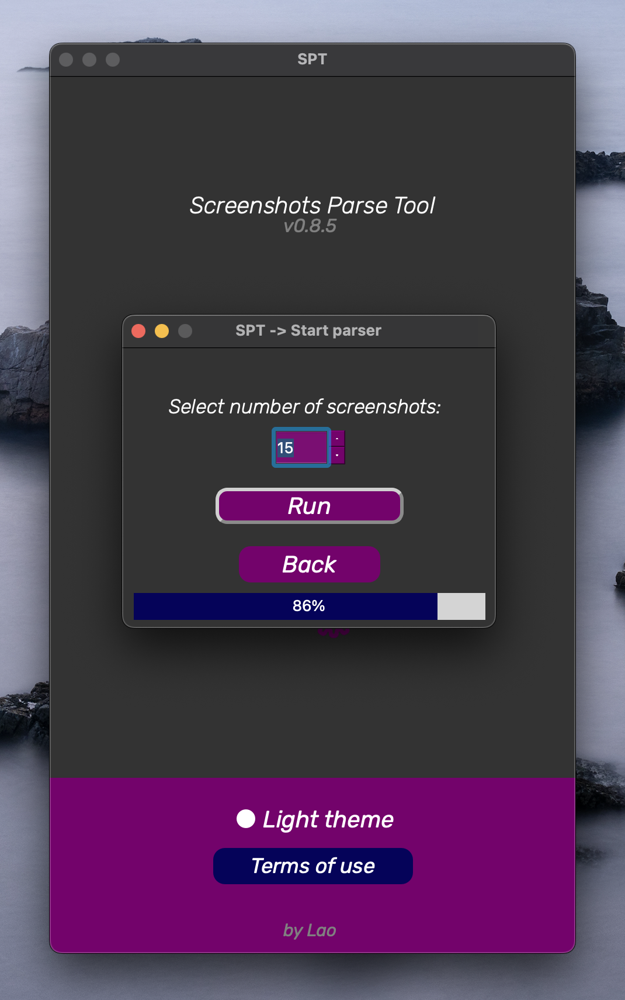

<p align="center">
  
</p>

<h1 align="center">
  SPT
</h1>

* [Parsing process](#parsing-process)
* [After the parser has finished](#after-the-parser-has-finished)
* [Usage](#usage)
* [Installation](#installation)


### Themes


### Parsing process



### After the parser has finished:


## Usage
SPT (Screenshots Parse Tool) exploits the "vulnerability" in the app "Lightshot" which is made for taking screenshots.
This "vulnerability" can show stranger's screenshots, so SPT generates unique links to this screenshots and then saves them to the auto-created folder in the app directory on your PC, for example: "Screenshots-Parse-Tool/Screenshots/06_01_2023".


## Installation
### MacOS/Linux
```
$ git clone https://github.com/codelao/Screenshots-Parse-Tool.git
$ cd Screenshots-Parse-Tool
$ bash spt.sh
```

### Windows
```
$ git clone https://github.com/codelao/Screenshots-Parse-Tool.git
$ cd Screenshots-Parse-Tool
$ spt.bat
```
