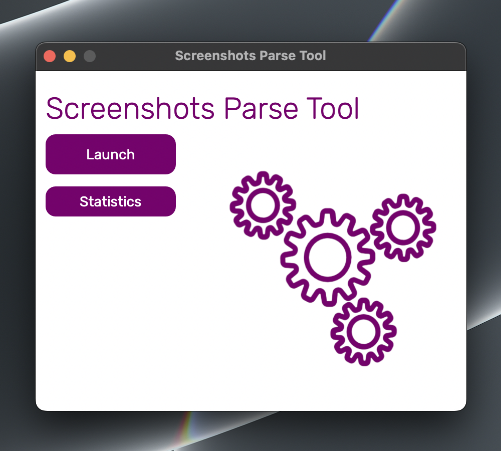
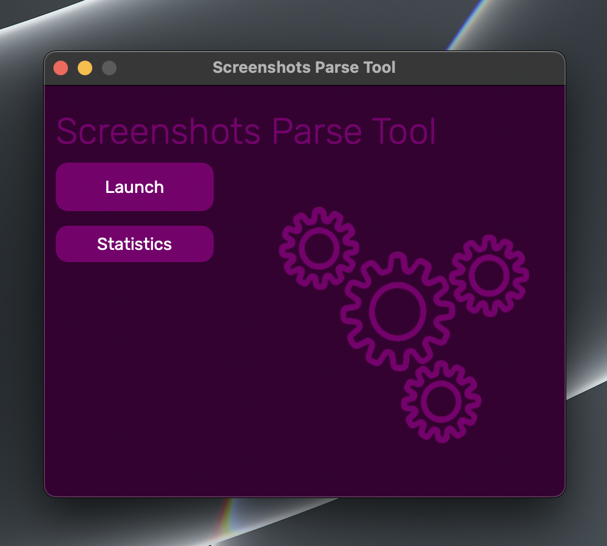
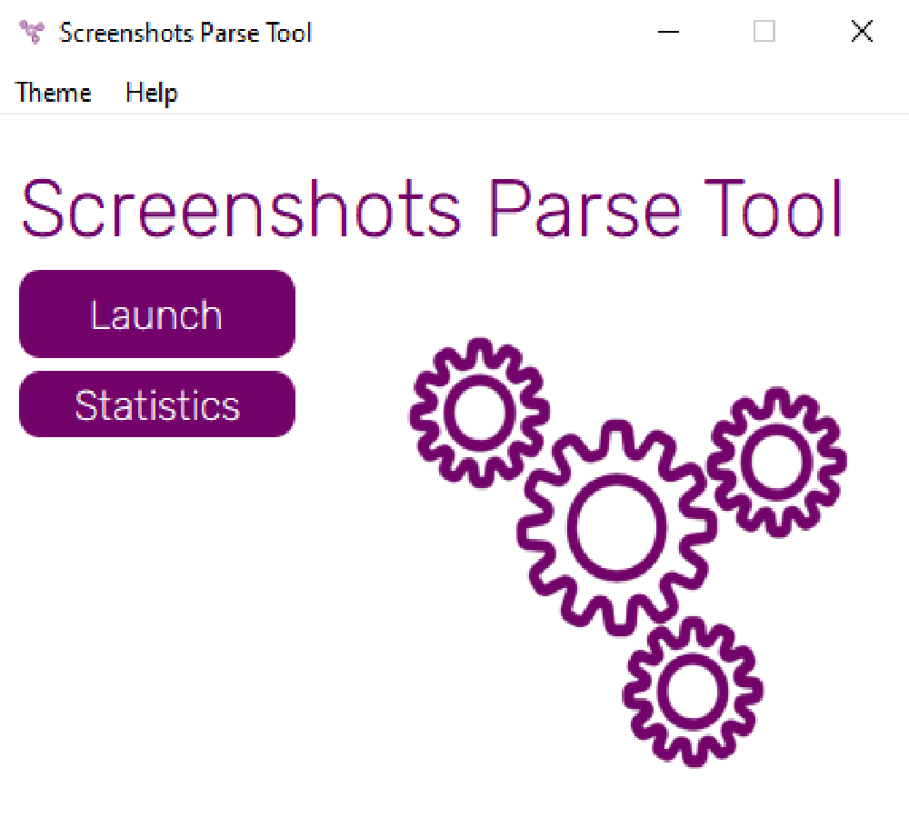
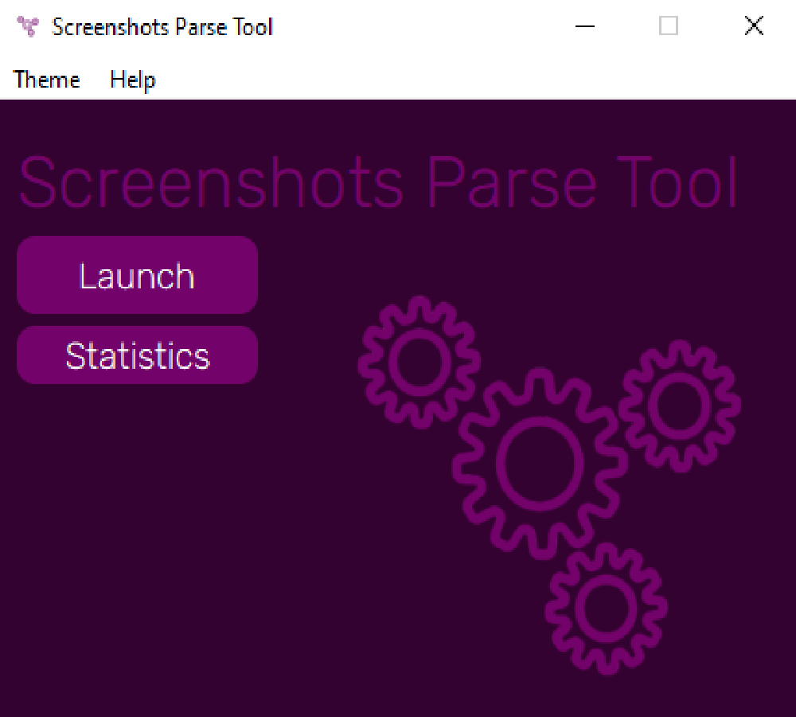
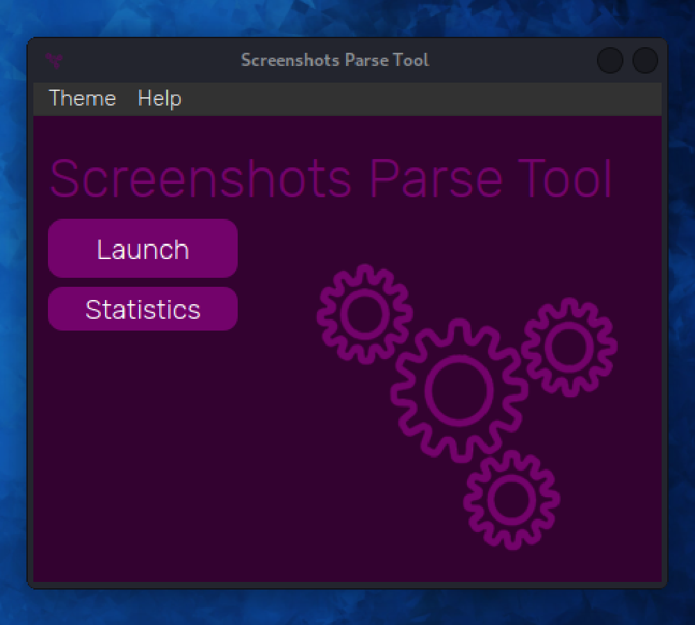
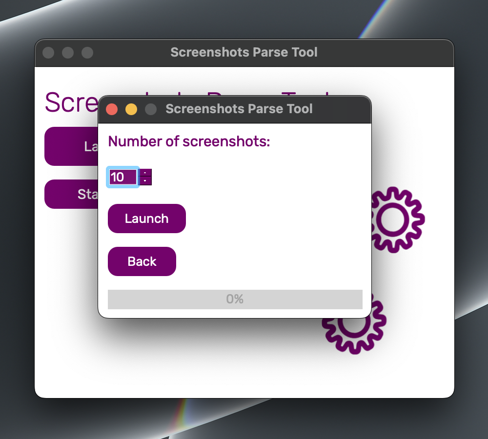
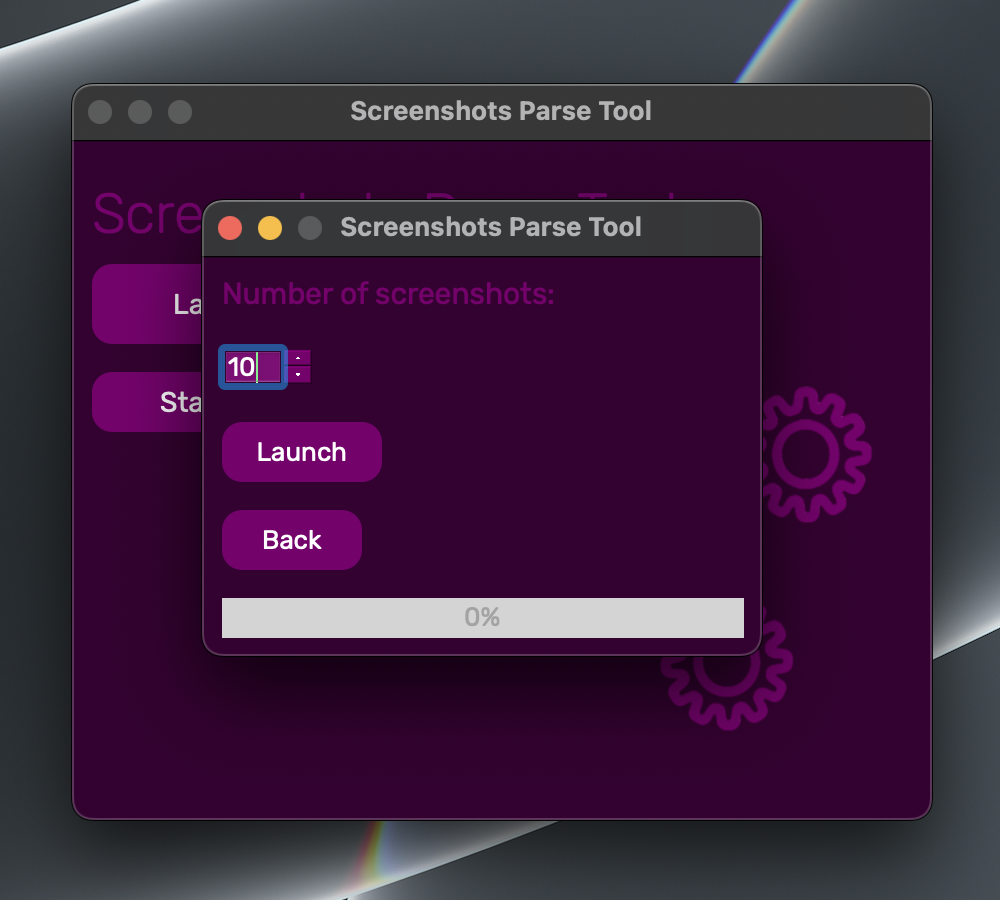
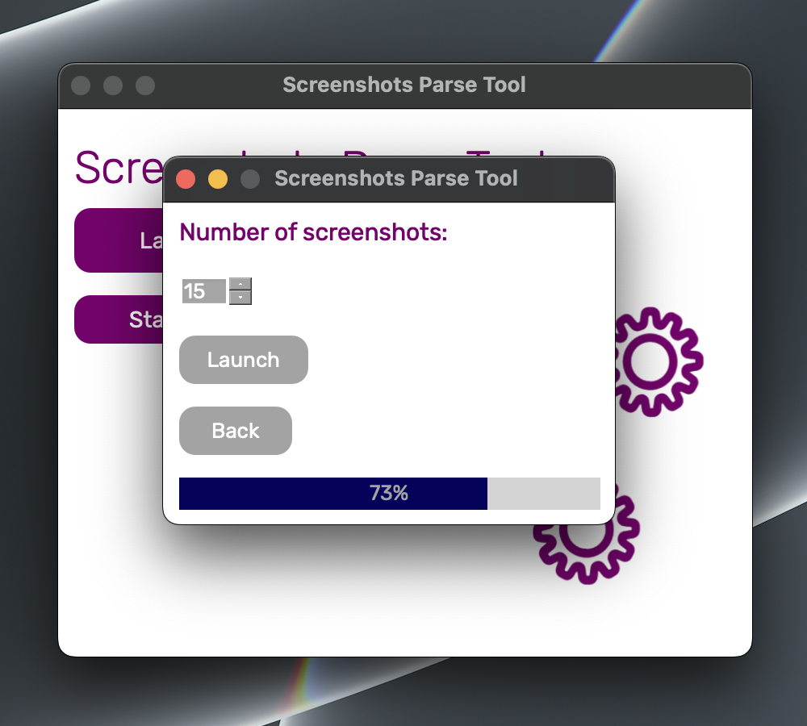
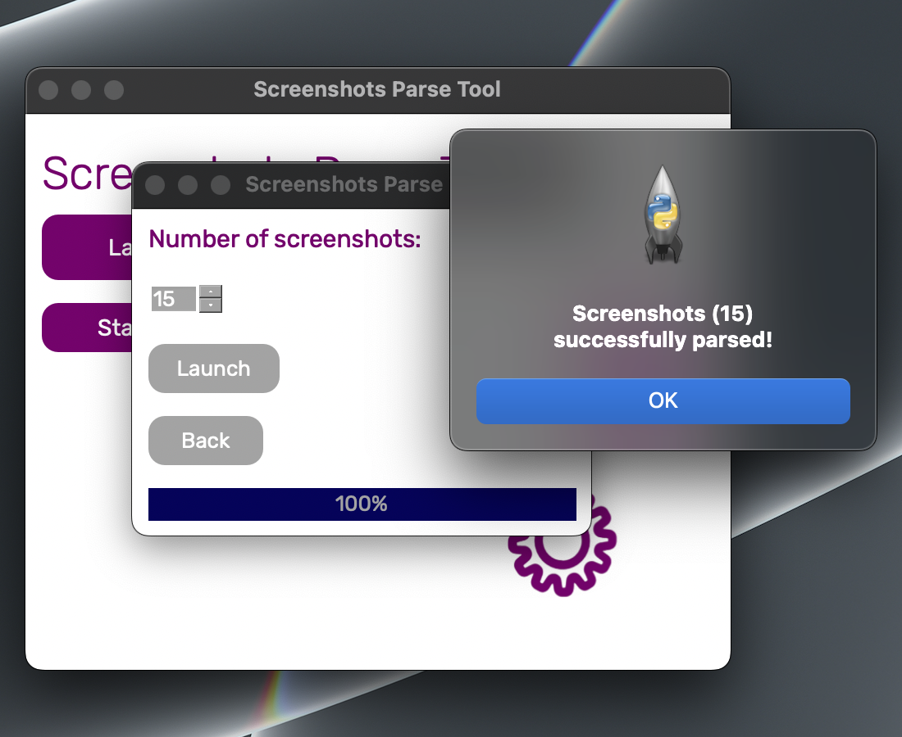
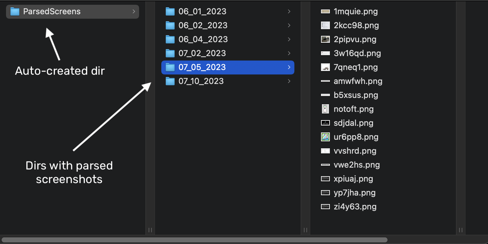

<p align="center">
  
</p>

<h1 align="center">
  SPT
</h1>

* [Usage](#usage)
* [Installation](#installation)
* [Uninstallation](#uninstallation)
* [Popular errors](#popular-errors)


### Themes:
#### macOS



#### Windows



#### Linux



### Parsing:





### Auto-created directories:



## Usage
SPT (Screenshots Parse Tool) exploits the "vulnerability" in the app, called "Lightshot" which is made for taking screenshots. This app is pretty popular and that's why it has over 4 billion stranger's screenshots saved.
This "vulnerability" can show this screenshots, so SPT generates unique links to this screenshots, parses them and after saves them to the auto-created directory on your Desktop. You can see how it looks [here](#directories). 

#### Important! 
**"Lightshot" developers added the function of accessing to other user's screenshots on their website themselves, so SPT doesn't exploit any prohibited vulnerabilities.**


## Installation
### Linux/macOS
#### Manual installation
1. Download [install.sh](https://github.com/codelao/Screenshots-Parse-Tool/releases) script from the latest release.
2. Open terminal in the directory with downloaded script and run the following command:
```
bash install.sh
```
3. Finally, now you can always run SPT using this command:
```
spt
```

#### Easy installation
*This method requires 'wget' to be installed in your system first.*
1. Run the following command:
```
wget https://github.com/codelao/Screenshots-Parse-Tool/raw/main/install.sh && bash install.sh
```
2. Finally, now you can always run SPT using this command:
```
spt
```

### Windows
#### Manual installation
1. Download [install.bat](https://github.com/codelao/Screenshots-Parse-Tool/releases) script from the latest release.
2. Open cmd in the directory with downloaded script and run the following command:
```
install
```
3. Finally, now you can always run SPT using this command:
```
spt
```

#### Easy installation
*This method requires 'wget' to be installed in your system first.*
1. Run the following command:
```
wget https://github.com/codelao/Screenshots-Parse-Tool/raw/main/install.bat && install
```
2. Finally, now you can always run SPT using this command:
```
spt
```


## Uninstallation
As installation scripts automatically delete all unnecessary files, you can uninstall SPT only using this command:
```
pip3 uninstall Screenshots-Parse-Tool
```


## Popular errors
### Installation errors:
- '*WARNING: The script spt.exe is installed in '\your\path\here' which is not on PATH.*
*Consider adding this directory to PATH or, if you prefer to suppress this warning, use --no-warn-script-location.*'

**This error usually occurs on Windows.**
**You can fix it using this command:**
```
setx PATH "%PATH%;\your\path\here"
```
**Replace '*\your\path\here*' with the real path, which is specified in the error message.**

### Program errors:
- '*Check your internet connection or try again.*'
- Program crashes after clicking on ***Launch*** button

**This errors may occure not only because you don't have internet connection, but also because your internet is too slow.**

### System errors:
- Nothing happens or an error occurs after running SPT

**In this case you should try reinstalling SPT. Please, make sure that you don't get any installation errors.**
**If you still can't fix this error, please report a bug [here](https://github.com/codelao/Screenshots-Parse-Tool/issues).**

- Program crashes during parsing process

**This error may occure because your internet connection is too slow.**

#### Important!
**Connecting your computer to the mobile internet can also cause problems with the program.**
