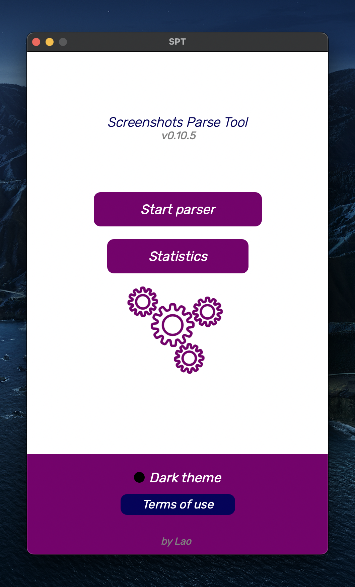
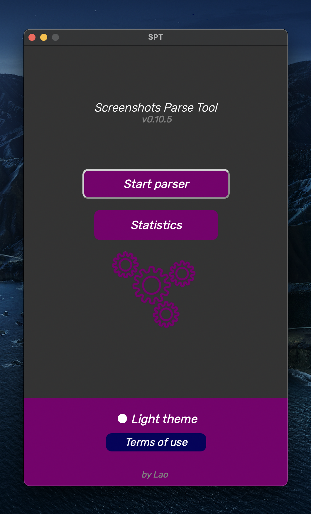
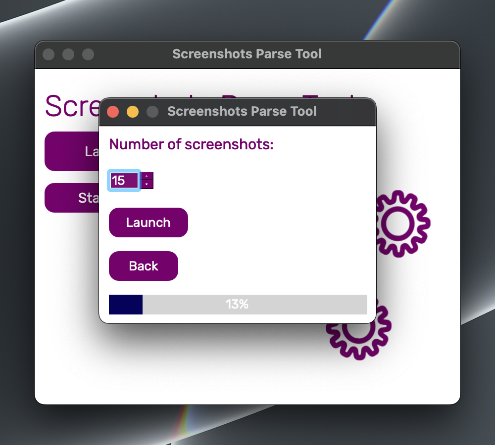
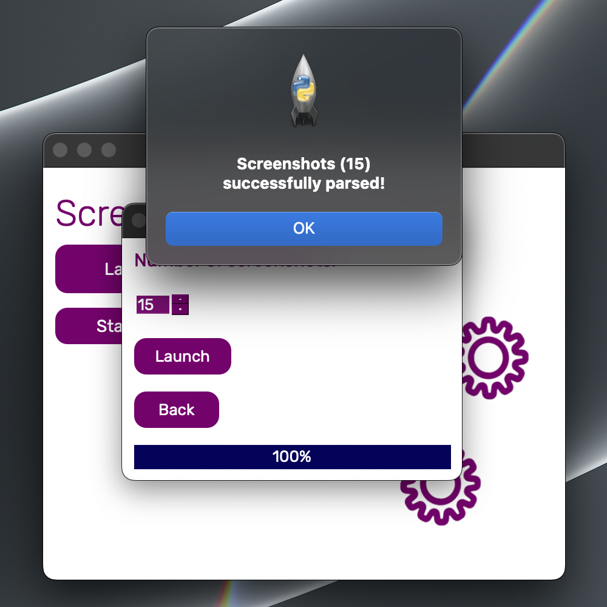
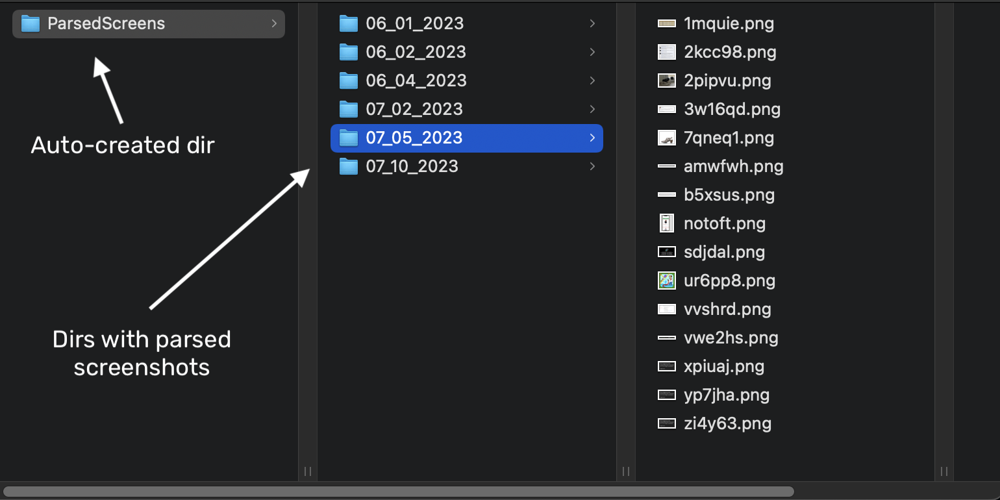

<p align="center">
  
</p>

<h1 align="center">
  SPT
</h1>

* [Usage](#usage)
* [Installation](#installation)
* [Popular errors](*popular-errors)


### Themes:




### Parsing:




### Directories:



## Usage
SPT (Screenshots Parse Tool) exploits the "vulnerability" in the app "Lightshot" which is made for taking screenshots.
This "vulnerability" can show stranger's screenshots, so SPT generates unique links to this screenshots and then saves them to the auto-created folder in the app directory on your PC, for example: "Screenshots-Parse-Tool/Screenshots/06_01_2023".


## Installation
### MacOS/Linux
```
git clone https://github.com/codelao/Screenshots-Parse-Tool.git
cd Screenshots-Parse-Tool
bash spt.sh
```

### Windows
```
git clone https://github.com/codelao/Screenshots-Parse-Tool.git
cd Screenshots-Parse-Tool
spt.bat
```


## Popular errors
### Configuration errors:
- *! Error moving SPT to /usr/local/bin*
- *! Error moving SPT to /usr/local/share*
- *! Error moving SPT to .\ProgramData*
**This errors may occure because you don't have enough rights to move SPT files to this directories.**

### Application errors:
- *Check your internet connection or disable VPN.*
**This error may occure not only because you don't have internet connection or VPN enabled, but also because your internet connection is too slow.**

### System errors:
- App doesn't work after launching it
**This error may occure because you have moved some SPT files to other directories.**
**You should move them back or clone this repository and launch configure script again.**

- App crashes during parsing
**This error may occure because your internet connection is too slow.**

#### Important!
**Connecting your computer to the mobile internet can also cause problems with the app.**
