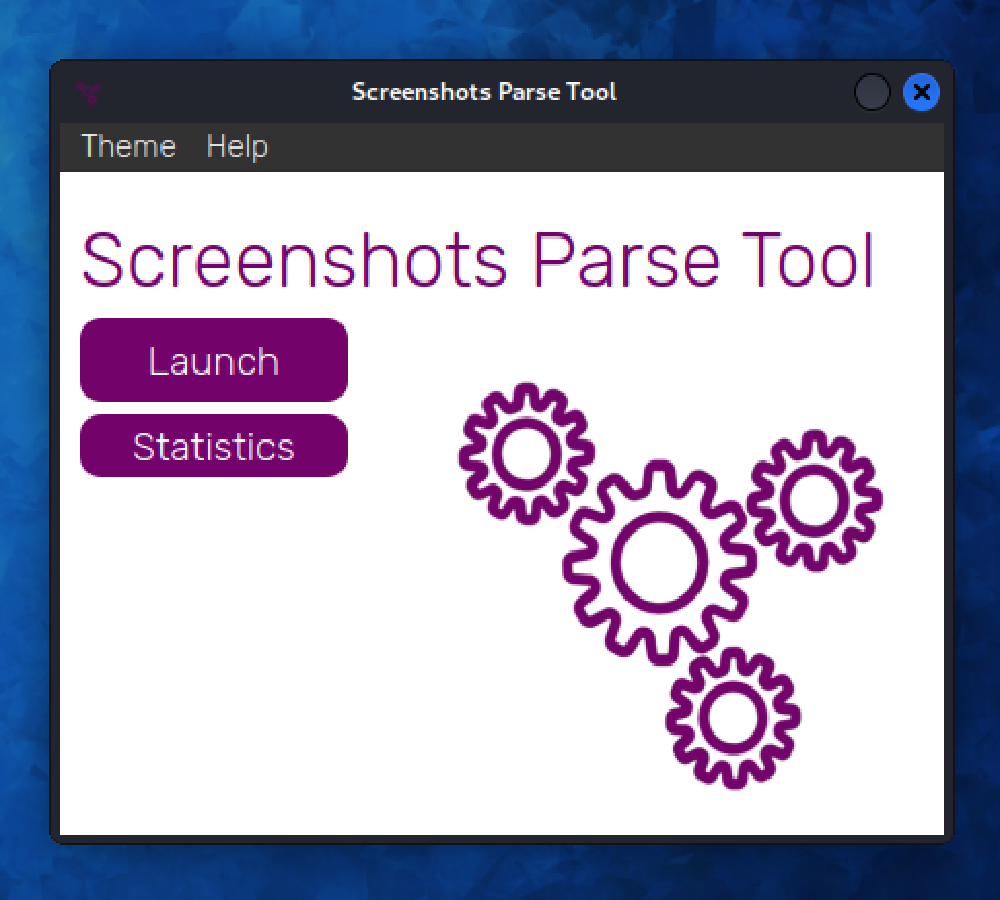

<p align="center">
  
</p>

<h1 align="center">
  SPT
</h1>

* [Usage](#usage)
* [Installation](#installation)
* [Popular errors](#popular-errors)


### Themes:
#### macOS


#### Windows


#### Linux



### Parsing:


### Auto-created directories:


## Usage
SPT (Screenshots Parse Tool) exploits the "vulnerability" in the app, called "Lightshot" which is made for taking screenshots. This app is pretty popular and that's why it has over 4 billion stranger's screenshots saved.
This "vulnerability" can show this screenshots, so SPT generates unique links to this screenshots, parses them and after saves them to the auto-created directory on your Desktop. You can see how it looks [here](#directories). 

#### Important! 
**"Lightshot" developers added the function of accessing to other user's screenshots on their website themselves, so SPT doesn't exploit any prohibited vulnerabilities.**


## Installation
### macOS/Linux
```
git clone https://github.com/codelao/Screenshots-Parse-Tool.git
cd Screenshots-Parse-Tool
chmod +x configure.sh
./configure.sh
```
Finally, now you can run SPT from any directory using this command in terminal:
```
spt
```

### Windows
First of all, you need to **run cmd as administrator**, otherwise you won't be able to correctly install SPT.
```
cd %userprofile%
git clone https://github.com/codelao/Screenshots-Parse-Tool.git
cd Screenshots-Parse-Tool
configure
```
Finally, now you can run SPT from any directory using this command in cmd:
```
spt
```


## Popular errors
### Configure errors:
- *! Script don't have enough rights to move SPT files to /usr/local/share*
- *! Script don't have enough rights to move SPT files to /usr/local/bin*
- *! Script don't have enough rights to move SPT files to C:\Windows\System32*

**This errors may occure because you didn't run *cmd* or configure script as administrator on Windows, or because you don't have root access at all.**

### Program errors:
- *Check your internet connection or disable VPN.*
- Program crashes after clicking on ***Launch*** button

**This errors may occure not only because you don't have internet connection or VPN enabled, but also because your internet connection is too slow.**

### System errors:
- *! Process or startup error*
- Nothing happens after using ```spt``` command

**This errors may occure because you have moved some SPT files to other directories.**
**You should move them back or clone this repository and run configure script again.**
**If you still can't fix this error, please report a bug [here](https://github.com/codelao/Screenshots-Parse-Tool/issues).**

- Program crashes during parsing

**This error may occure because your internet connection is too slow.**

#### Important!
**Connecting your computer to the mobile internet can also cause problems with the program.**
